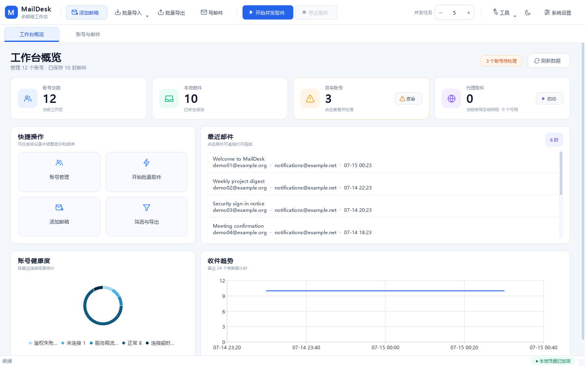
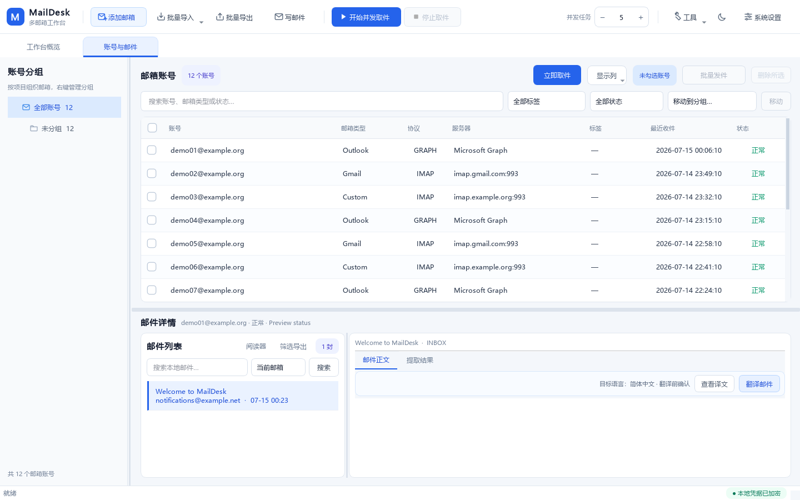

# MailDesk Lightweight

面向 Windows 与 macOS 的本地多邮箱管理工具轻量版。

[](https://github.com/17sho/MailDesk-Lightweight/releases)
[](https://github.com/17sho/MailDesk-Lightweight/releases)
[](docs/MACOS.md)
[](https://www.python.org/)
[](LICENSE)

> 本仓库是 MailDesk 的独立轻量分支。它删除了 QtWebEngine、Chromium、QtQuick、QML 和 WebChannel，邮件阅读器使用 PySide6 原生 `QTextBrowser`。轻量版拥有独立的更新通道，不会自动升级到完整版。

## 界面预览



<details>
<summary>查看账号与邮件界面</summary>



</details>

截图使用 `example.org` / `example.net` 虚构账号和演示邮件生成，不包含真实凭据或私人邮件。

## 轻量版有什么不同

| 项目 | 轻量版表现 |
|---|---|
| 邮件阅读器 | Qt 原生 `QTextBrowser` |
| Chromium / QtWebEngine | 完全不包含 |
| 普通文本、链接、表格 | 支持 |
| CID、data URI、附件图片 | 支持 |
| 外部网络图片 | 轻量异步加载；拦截明显追踪像素 |
| 复杂 CSS、响应式 HTML | 可能与浏览器排版不同 |
| Windows onefile | 约 39 MiB |
| macOS ZIP | Apple 芯片约 33 MiB；Intel 约 36 MiB |

轻量版不会启动浏览器内核。邮件自身携带的 CID/data 图片直接显示；HTML 仅引用的公开 HTTPS 图片由现有网络栈异步载入内存，不写入磁盘，并跳过声明为 1×1/2×2 的明显追踪像素。复杂浏览器 CSS 的排版完整度仍可能低于 Chromium 阅读器。

## 主要功能

- TXT、CSV、JSON 和任意文本批量导入，支持预览、校验、去重和自动识别。
- 通用 IMAP、POP3、SMTP，以及 Microsoft Graph、OAuth2 IMAP。
- Gmail 应用专用密码和 OAuth2，QQ、163 等常见邮箱服务器自动配置。
- 单账号立即取件、批量并发取件、跨文件夹扫描、增量同步。
- IMAP、Graph 优先快速同步全部邮件头，点击列表项时才加载正文、图片和附件。
- 邮件正文、发件人、收件人、附件、CID 图片、验证码和自定义内容提取。
- 当前账号或全局邮件搜索；可联网深度筛选 IMAP/Graph 正文并只下载命中邮件；支持自定义筛选、复制与导出。
- 单账号发件和批量发件，支持附件。
- 多级分组、标签、异常账号筛选、代理池和账号独立代理。
- SQLite 本地持久化；敏感字段使用受 Windows DPAPI 或 macOS 钥匙串保护的 Fernet 密钥加密。
- 系统托盘、定时任务、桌面通知、审计日志、深浅色主题和在线更新。

## 下载与安装

从 [Releases](https://github.com/17sho/MailDesk-Lightweight/releases) 下载对应平台文件：

- Windows 10/11 x64：优先使用 `windows-x64-onedir.zip`；也提供单文件版。
- Apple Silicon Mac：下载 `macos-arm64.dmg`。
- Intel Mac：下载 `macos-x64.dmg`。

macOS 首次运行和安装说明参见 [docs/MACOS.md](docs/MACOS.md)。

程序采用便携数据布局。数据库、密钥、邮件缓存和日志默认保存在程序旁的 `MailDesk Data`，更新临时文件保存在同级 `.maildesk-update`，不会主动迁移到其他磁盘。更新时会保留用户数据。

## 从源码运行

需要 Python 3.12 或更高版本：

```powershell
py -3.12 -m venv .venv
.\.venv\Scripts\Activate.ps1
python -m pip install -r requirements.txt
python -m mailbox_manager
```

macOS：

```bash
python3.12 -m venv .venv
source .venv/bin/activate
python -m pip install -r requirements.txt
python -m mailbox_manager
```

## 构建

Windows：

```powershell
python build.py --mode onefile --clean
python build.py --mode onedir --clean
```

macOS 必须在对应架构的真实 Mac runner 上构建：

```bash
python build_macos.py --clean
```

项目的 GitHub Actions 会分别使用 Apple Silicon 和 Intel runner 生成原生 `.app`、DMG 与 ZIP，并执行：

- Ruff 静态检查。
- 完整自动化测试。
- 原生架构校验。
- 应用启动探针。
- 更新包安装前验证。
- Chromium、QtWebEngine、QtQuick、QML、WebChannel 零残留检查。
- SHA-256 校验文件生成。

## 测试

```bash
python -m pip install -r requirements-dev.txt
python -m ruff check src tests build.py build_macos.py release.py
python -m pytest -q
```

当前轻量版回归结果：`427 passed, 3 skipped`。

## 安全与使用范围

MailDesk 仅用于管理使用者本人拥有或已获得明确授权的邮箱。请遵守邮箱服务商条款、组织安全政策与适用法律。

项目不提供验证码绕过、封禁规避、隐藏式网页登录、批量修改第三方账户密码、恢复邮箱劫持或绕过 Rate Limit 等能力。请勿将软件用于未经授权的访问、垃圾邮件或其他滥用行为。

提交安全问题时请使用仓库的 [Security Advisory](https://github.com/17sho/MailDesk-Lightweight/security/advisories/new)，不要在公开 Issue 中发布真实账号、令牌、密码或邮件内容。

## 许可证

本项目使用 [MIT License](LICENSE)。第三方组件许可见 [THIRD_PARTY_NOTICES.md](THIRD_PARTY_NOTICES.md) 和 `legal/`。

## 相关项目

需要 Chromium 级 HTML/CSS 邮件排版兼容时，请使用完整版 [MailDesk](https://github.com/17sho/MailDesk)。
